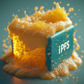

# 🍺 ServeBeer - Community-Sponsored IPFS Storage



**Decentralized file hosting powered by Raspberry Pi infrastructure and crypto community support.**

> *"From algorithm to program" - NFTomczain Guerrilla Infrastructure*

[](https://opensource.org/licenses/MIT)
[](https://www.python.org/downloads/)
[](https://ipfs.io/)
[](https://github.com/nftomczain/servebeer-ipfs)

## 🌟 Features

- **🔗 IPFS Pinning Service** - Pin any IPFS content to distributed nodes
- **📤 Direct File Upload** - Upload files directly to IPFS network
- **🎯 Community Sponsored** - Sustainable funding through crypto sponsors
- **🔒 Dual Authentication** - Email & MetaMask wallet support
- **📊 Real-time Dashboard** - Monitor storage usage and pinned content
- **⚡ Lightning Fast** - Distributed content delivery
- **🛡️ No KYC Required** - Privacy-focused design

## 🚀 Quick Start

### Prerequisites

- Python 3.8+ installed
- IPFS node running locally or remotely
- Git installed

### Installation

```bash
# Clone the repository
git clone https://github.com/nftomczain/servebeer-ipfs.git
cd servebeer-ipfs

# Create virtual environment
python -m venv venv
source venv/bin/activate  # On Windows: venv\Scripts\activate

# Install dependencies
pip install -r requirements.txt

# Copy environment template
cp .env.example .env
# Edit .env with your settings

# Initialize database
python -c "from app import init_database; init_database()"

# Start IPFS daemon (if not running)
ipfs daemon

# Run the application
python app.py
```

Access the application at `http://localhost:5000`

## 🏗️ Architecture

```
┌─────────────────┐    ┌──────────────────┐    ┌─────────────────┐
│   User Client   │───▶│  ServeBeer API   │───▶│  IPFS Network   │
└─────────────────┘    └──────────────────┘    └─────────────────┘
                               │
                               ▼
                       ┌──────────────────┐
                       │ SQLite Database  │
                       │ (User & Pins)    │
                       └──────────────────┘
```

**Technology Stack:**
- **Backend:** Python Flask
- **Database:** SQLite (easily upgradeable to PostgreSQL)
- **Storage:** IPFS (InterPlanetary File System)
- **Frontend:** HTML5, CSS3, Vanilla JavaScript
- **Authentication:** Email/Password + MetaMask wallet
- **Infrastructure:** Raspberry Pi nodes (guerrilla infrastructure)

## 📖 Usage

### For Users

1. **Register Account**
   - Email registration or MetaMask wallet
   - Choose your preferred authentication method

2. **Pin IPFS Content**
   - Enter any valid IPFS CID (Content Identifier)
   - Content gets pinned to our distributed nodes
   - Access via multiple IPFS gateways

3. **Upload Files** (Paid tier)
   - Direct file upload to IPFS
   - Automatic pinning and CID generation
   - Permanent distributed storage

### For Sponsors

Support the decentralized infrastructure through crypto sponsorship:

- **🥉 Bronze Tier:** 0.0001 BTC/month (~$5)
- **🥈 Silver Tier:** 0.0005 BTC/month (~$20)
- **🥇 Gold Tier:** 0.001 BTC/month (~$50)
- **🏛️ Mecenas Tier:** 0.002 BTC/month (~$100)

## 🔧 Configuration

Create `.env` file with your settings:

```env
# Flask Configuration
SECRET_KEY=your-secret-key-here
TESTING_MODE=False

# IPFS Configuration
IPFS_API_URL=http://localhost:5001/api/v0

# Database Configuration
DATABASE_PATH=database/servebeer.db

# Storage Limits (bytes)
FREE_TIER_LIMIT=262144000   # 250MB
PAID_TIER_LIMIT=1073741824  # 1GB
```

## 🐳 Docker Deployment

```bash
# Using Docker Compose (recommended)
docker-compose up -d

# Or build manually
docker build -t servebeer-ipfs .
docker run -p 5000:5000 -v ./database:/app/database servebeer-ipfs
```

## 📚 API Documentation

### Authentication Endpoints
- `POST /auth/wallet` - MetaMask wallet authentication
- `POST /login` - Email/password login
- `POST /register` - User registration

### Core Endpoints
- `POST /api/pin` - Pin IPFS CID
- `POST /upload` - Upload file to IPFS
- `GET /dashboard` - User dashboard
- `GET /health` - Health check

### Public Endpoints
- `GET /` - Landing page
- `GET /sponsors` - Sponsor tiers
- `GET /status` - System status

[Full API Documentation](docs/api.md)

## 🏛️ Philosophy

ServeBeer embodies the **NFTomczain Universe** philosophy of technological resistance:

> *"Decentralization as a tool of resistance against systemic exclusion"*

This project is part of a larger narrative:
- **Personal survival** through technology (NFTomczain Manifest)
- **Global revolution** via decentralization (NetNeroJes Manifest)
- **Practical infrastructure** for the movement (Pi-Grade Project)

## 🤝 Contributing

We welcome contributions! Please see our contributing guidelines:

1. Fork the repository
2. Create feature branch (`git checkout -b feature/AmazingFeature`)
3. Commit changes (`git commit -m 'Add AmazingFeature'`)
4. Push to branch (`git push origin feature/AmazingFeature`)
5. Open a Pull Request

## 🧪 Testing

```bash
# Run tests
python -m pytest

# Run specific test
python -m pytest tests/test_ipfs.py

# Run with coverage
python -m pytest --cov=app tests/
```

## 🚀 Production Deployment

For production deployment, see [docs/deployment.md](docs/deployment.md)

**Key considerations:**
- Use production WSGI server (Gunicorn/uWSGI)
- Configure reverse proxy (Nginx)
- Set up SSL certificates
- Use production database (PostgreSQL)
- Configure monitoring and logging

## 📊 Roadmap

- [x] **Phase 1:** Basic IPFS pinning service
- [x] **Phase 2:** User authentication and dashboard
- [x] **Phase 3:** File upload functionality
- [ ] **Phase 4:** Mobile app
- [ ] **Phase 5:** Multi-node federation
- [ ] **Phase 6:** Advanced analytics

## 🔐 Security

- All uploads are scanned for basic safety
- User content isolation
- Rate limiting to prevent abuse
- Audit logging for security events
- No tracking or surveillance

**Report security issues:** Create a private GitHub issue or contact maintainers directly.

## 📄 License

This project is licensed under the MIT License - see the [LICENSE](LICENSE) file for details.

## 🙏 Acknowledgments

- **IPFS Team** - For the amazing decentralized storage protocol
- **Raspberry Pi Foundation** - For affordable computing hardware
- **Crypto Community** - For supporting decentralized infrastructure
- **Beta Testers** - For helping improve the platform

## 💰 Crypto Addresses

Support the project directly:

- **Bitcoin:** `bc1qvma6an44xj8nsq8cdhtvvkdrt8rgdm7ukh82cz`
- **Ethereum:** `0x660C2192D2bBA01B8CEff10F1416accA9e25bC88`
- **Optimism:** `0xa4d980968153da6C8EcD2c0881628953b04EA751`

## 🔗 Links

- **ENS Domain:** [nftomczain.eth](https://nftomczain.eth.link)
- **IPFS Gateway:** [ServeBeer CDN](https://servebeer.com)
- **Project Universe:** [NFTomczain Manifests](https://github.com/nftomczain)

---

*"🔥 We are the fire beneath the ashes. 🌍 We build the ghost layer."*

**© 2025 NFTomczain & NetNeroJes | Guerrilla Infrastructure | 0x660C**# servebeer-ipfs
